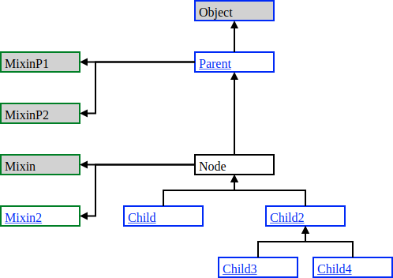

# Inheritance diagram builder

This builds an inheritance diagram for a some node of interest. Initially it is designed to use in documentations with class description to show parent stack, child nodes and mixed in nodes.

Nodes that contains `link` property will be highlighted and behave as usual link element to allow fast jumping to the next interested node in the documentation.


## Limitations

1. Rectangle dimensions around the text (node name) and text offset should be defined manually. SVG v1.1 does not have the feature like `box-model` for an element in HTML+CSS, so it is not possible to automatically calculate the border for a text by taking into account the font size and paddings.

	* [SVG v2](https://www.w3.org/TR/2016/CR-SVG2-20160915/Overview.html) will have some interisting features which should simplify this: [Text layout – Content Area](https://www.w3.org/TR/2016/CR-SVG2-20160915/text.html#TextLayoutContentArea)

1. Arrows at the end of connection line cannot inherit the line styles (colors).

	* [SVG v2](https://www.w3.org/TR/2016/CR-SVG2-20160915/Overview.html) will fix this by defining the context: [Specifying paint](https://www.w3.org/TR/2016/CR-SVG2-20160915/painting.html#TermContextElement)

Due to upcomming features/improvements in [SVG v2](https://www.w3.org/TR/2016/CR-SVG2-20160915/Overview.html) the above limitations will not have coded workarounds and you should manually tune them.

Hope [SVG v2](https://www.w3.org/TR/2016/CR-SVG2-20160915/Overview.html) will be released and implemented by browsers soon :)


## Usage exmaple

```js
var graph = new (require('inheritance-diagram'))(
	// Node for what the diagram will be built
	'Node',

	// Full map of nodes and relationships
	{
		Node: {
			parent: 'ParentNode',
			children: ['Child', 'Child2'],
			mixins:['Mixin', 'Mixin2', 'Mixin3']
		},
		ParentNode: {
			parent: 'Object',
			children: ['Node'],
			link: '#ParentNode'
		},
		Child2: {
			link: '#Child2'
		},
		Mixin3: {
			link: '#Mixin3'
		}
	},

	// Optional custom CSS
	'.no-ref rect {fill: lightgray;}',

	// Customize rendering properties
	{
		node: {
			dimensions: {
				width: 80
			},
			spacing: {
				horizontal: 30,
				vertical: 30
			},
			text: {
				dx: 20
			}
		}
	}
);
```

The output is a string of SVG element. So if you want to save the output into the file, then you should write an additional code that will do this. The example of such is below:

```js
require('fs').writeFile('out.svg', graph.getResult(), err => {
	if (err) {
		throw err;
	}
});
```

The similar task is required if you want to get the CSS from a file. The example is below:

```js
require('fs').readFile('styles.css', 'utf8', (err, data) => {
	if (err) {
		throw err;
	}

	var graph = new (require('inheritance-diagram'))('...', {...}, data);
});
```


## Output example


